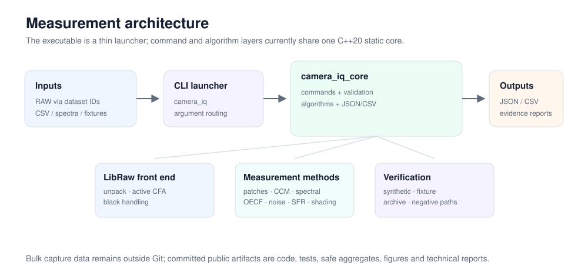

# Camera IQ Toolkit

[](https://github.com/ferazambuja/cpp-camera-iq-toolkit/actions/workflows/ci.yml)

This C++20 toolkit turns RAW camera captures and measured references into
inspectable image-quality results. It covers the measurement chain from
LibRaw/CFA handling through color, spectral, tone, noise, and slanted-edge
sharpness analysis, with structured JSON/CSV outputs and CTest-backed
validation.

**C++20 · LibRaw · CMake/CTest · numerical methods · color science · JSON/CSV**

## Engineering results at a glance

- **SFR/MTF:** processed **299 field ROIs** across D800 and D810 aperture
  sweeps. The D810 peak occurred at f/5.6; the D810 trend did not transfer to
  the D800, where field asymmetry and capture-specific behavior were retained as
  findings rather than forced into a passing rule.
- **Spectral characterization:** extracted a Canon 5D2 spectral-sensitivity
  function from monochromator RAW sweeps, closed four same-session camera/chart
  datasets with minimum channel correlation above **0.992**, and compared five
  cameras with Luther and ISO 17321-style color-fidelity metrics.
- **ColorChecker / CCM:** matched uncorrected 140-patch RAW extraction to a
  reference tool at correlation above **0.99999998** with sub-0.4 DN RMSE, then
  ran a corrected RAW-to-linear-CCM path with **4.134 mean held-out
  CIEDE2000**.
- **Measurement judgment:** rejected a ColorChecker grid despite correlations
  above 0.999 because its center error reached **16.449 px**, and rejected an
  invalid Stepchart strip model before accepting the measured ring geometry.
- **CFA flat-field response:** screened **52 sphere captures**, retained three
  usable f/8 frames, and measured center-normalized green and chromatic fields.
  A **19.65% quadrant asymmetry** prevents interpreting the intensity map as
  isolated lens vignetting.

## Featured case studies

| Case study | Methods | Result |
|---|---|---|
| [D800/D810 + 50 mm f/1.4G SFR aperture and field analysis](docs/case-studies/sfr-mtf-aperture-field.md) | Slanted-edge algorithm, field behavior, advisory cross-checks, failure transfer | 299 accepted field ROIs; capture-system-specific trend and field findings |
| [Spectral sensitivity and color fidelity](docs/case-studies/spectral-color-fidelity.md) | RAW monochromator extraction, physical closure, Luther/SMI comparison | Four-camera closure; stable five-camera endpoint ordering |
| [ColorChecker extraction and CCM validation](docs/case-studies/colorchecker-ccm.md) | RAW patch extraction, flat field/WB, linear CCM, held-out Delta E | 140-patch pipeline with explicit dark-patch diagnostics |
| [CFA flat-field response](docs/case-studies/cfa-flat-field-response.md) | Black-subtracted Bayer grids, center normalization, clipping/pedestal/repeat gates | 3/52 usable sphere frames; intensity asymmetry separated from smaller R/G and B/G variation |

The [technical documentation index](docs/README.md) connects these case studies
to the OECF, noise, demosaic, localization, dataset, and provenance reports.



The current architecture uses a thin executable over one static C++ core that
contains command handling, validation, measurement algorithms, and
serialization. The diagram describes the implementation as it exists; it does
not imply a separate production service or ISP.

## Capability map

| Area | Implemented work |
|---|---|
| RAW/CFA | LibRaw unpack, active-area handling, tiled black subtraction, Bayer-plane statistics, bilinear demosaic |
| Color | ColorChecker-SG extraction, flat-field and WB policies, RGB-to-XYZ CCM fitting, Delta E 76/2000, held-out diagnostics |
| Spectral | Monochromator RAW extraction, physical closure, Luther-condition residuals, ISO 17321-style SMI approximation |
| Tone and noise | Exposure grouping, relative OECF, Stepchart oracle/ring extraction, dark temporal noise, DSNU, DN-referred variance |
| Sharpness | Green-linear slanted-edge SFR, MTF50/MTF50P, aperture sweeps, 23-ROI field maps |
| Spatial response | Per-CFA flat-field maps, center-normalized R/G and B/G fields, quadrant asymmetry, pedestal and repeat diagnostics |
| Engineering systems | CLI validation, JSON/CSV reporting, synthetic and negative-path tests, archive-backed checks, privacy-safe dataset IDs |

Implemented commands:

`manifest`, `raw-stats`, `demosaic`, `dark-calibration`, `noise`, `sfr`,
`exposure-response`, `oecf-fit`, `oecf-stepchart`, `reference-info`,
`ccm-fit`, `patches`, `spectral-response`, `spectral-closure`,
`spectral-quality`, `spectral-smi`, and `shading`.

## Reproducibility and data access

The source RAW datasets are intentionally outside Git, but the repository does
not stop at prose. It includes publication-safe aggregate tables, deterministic
SVG generation, public fixtures for parser/CLI paths, implementation links,
and the full test suite.

```bash
cmake -S . -B build -DCMAKE_BUILD_TYPE=Release
cmake --build build --parallel
ctest --test-dir build --output-on-failure

# Rebuild the figures from committed aggregate CSVs.
python3 tools/generate_portfolio_figures.py
python3 tools/generate_portfolio_figures.py --check
```

A tiny fixture demonstrates the public dataset/manifest path without pretending
to be a real image-quality capture:

```bash
./build/camera_iq manifest data/samples/manifest_fixture --no-exif \
  --out out/public_manifest_fixture.json
```

See [dataset handling](docs/DATASETS.md), the
[aggregate-data notes](docs/data/README.md), and the
[tool index](tools/README.md) for the public/private boundary and regeneration
commands.

## Build and run

Requirements: a C++20 compiler, CMake 3.20 or newer, and LibRaw
(`brew install libraw` or `apt-get install libraw-dev`).

```bash
cmake -S . -B build -DCMAKE_BUILD_TYPE=Release
cmake --build build --parallel
./build/camera_iq --help
```

Real-data commands use a dataset ID and paths relative to that dataset:

```bash
./build/camera_iq raw-stats --dataset clrs589_project_camera \
  "<relative/raw/file.RAF>" --out out/raw-stats.json

./build/camera_iq sfr d800_d810_sfr_2016 \
  --raw "<relative/slanted-edge/file.NEF>" \
  --oracle-y-multi "<relative/advisory-table.csv>" \
  --out out/sfr.json
```

Copy `configs/datasets.example.json` to the gitignored
`configs/datasets.local.json` to configure local roots. Bulk RAW captures,
measured references, and commercial-tool exports remain outside the public
repository; the reports retain safe aggregates and enough provenance to
interpret them.

## Interpretation boundaries

This is a research toolkit, not a certified ISO laboratory suite or a
production ISP. The reports distinguish sensor-linear measurements from
rendered-luma comparisons, DN-domain diagnostics from electron-calibrated
quantities, compatible chart references from exact per-unit measurements, and
advisory reference-tool comparisons from equivalence claims.

Primary method families include ISO 12233-style slanted-edge SFR, ISO
14524-informed OECF work, ISO 15739/EMVA-inspired noise diagnostics, CIE
Delta E, and an ISO 17321-style SMI approximation. Exact conformance is claimed
only where the implementation and available calibration evidence support it.

## About

More projects and contact context:
[Imaging Engineering & Color Science profile](https://github.com/ferazambuja).

License: [MIT](LICENSE).
