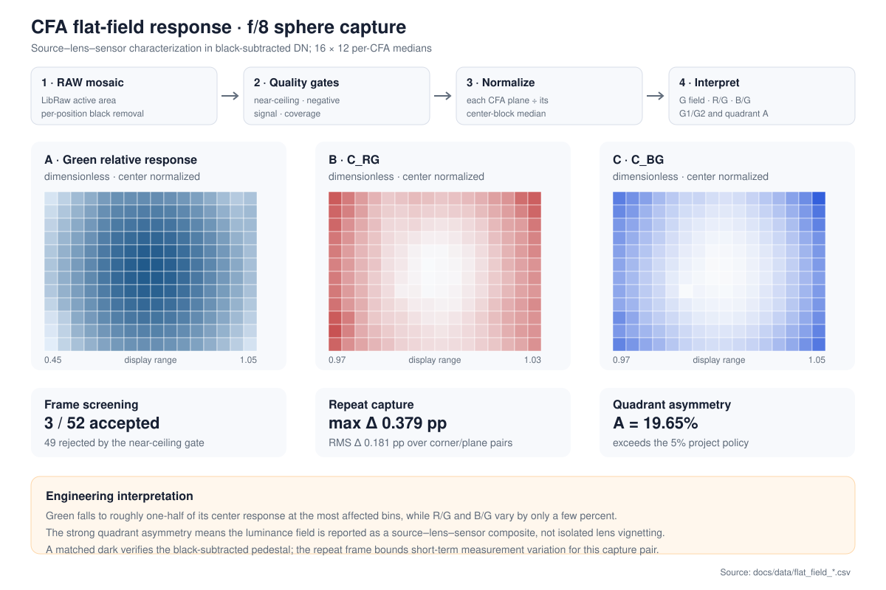
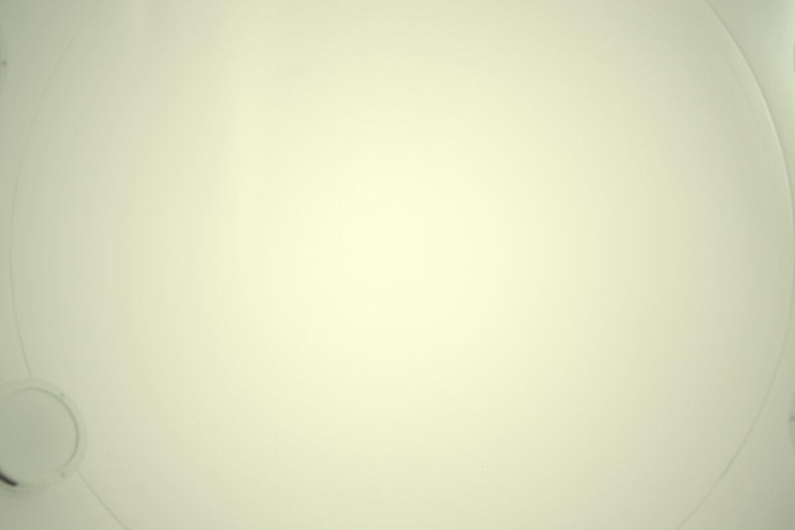

# CFA Flat-Field Response in a Uniform-Field Capture

[Detailed method report](../reports/FLAT_FIELD_RESPONSE.md) ·
[aggregate response maps](../data/flat_field_response.csv) ·
[52-frame gate table](../data/flat_field_summary.csv) ·
[implementation](../../src/shading.cpp) ·
[tests](../../tests/test_shading.cpp)

Three of 52 integrating-sphere captures retained usable headroom; the primary
f/8 frame showed 19.65% green-field quadrant asymmetry, exceeding the declared
5% criterion and conflicting with a centered radial scalar model for the
measured composite field. The `shading` command measures that spatial response
directly in the black-subtracted Bayer mosaic. The result remains a
capture-system characterization because the available captures do not separate
illumination nonuniformity from lens, alignment, mechanical-shading, or
sensor-angular effects.

The `clrs589_project_camera` archive retains the Fujifilm X-T100 and Fujinon XF
14 mm f/2.8 R sphere and dark captures. The surviving set is sufficient to
detect and quantify composite-field asymmetry, while isolated attribution
would require an independent source map and source/camera rotation control. The
study therefore reports capture-system characterization rather than assigning
a lens correction.

*The figure shows the accepted f/8, 1/1000 s primary frame. Each heatmap uses
16 × 12 per-CFA medians divided by that plane's 400 × 400 px center-block
median. The green map shows the green-CFA relative response; `C_RG` and `C_BG`
show independently center-normalized chromatic ratios. The 19.65% quadrant
asymmetry exceeds the declared 5% project policy and is inconsistent with a
centered radial scalar model for the measured composite. It does not identify
the responsible component;
the missing source and rotation controls preclude isolated lens attribution.
The repeat reads 19.996%, a 0.348 percentage-point pair
difference that supports stability of the observed high `A` only; two high-`A`
frames do not derive or validate the policy threshold.*

## What the measurement found

The archive contains 52 sphere frames spanning f/5.6, f/8, and f/9. A
signal-referred near-ceiling gate accepted three f/8 frames and rejected 49
frames. Every f/5.6 and f/9 frame was near ceiling, so the dataset cannot
support an aperture trend.

For the primary accepted frame:

- green relative response ranged from 0.4801 to 1.0005;
- `C_RG` ranged from 0.9773 to 1.0000;
- `C_BG` ranged from 0.9997 to 1.0447;
- `C_G1G2` stayed between 0.9989 and 1.0023;
- the matched repeat frame differed by at most 0.3787 percentage points over
  the 16 corner/plane comparisons, with 0.1813 pp RMS;
- an exposure-metadata-compatible dark control produced 0 DN full-frame median
  residual at all four CFA positions and passed finite-coverage, camera,
  center/corner, and 1 DN tolerance checks.

The strong green-response falloff is accompanied by much smaller
chromatic variation and close agreement between the two green positions. The
left/right and top/bottom imbalance remains the controlling interpretation:
one uniform-field capture cannot determine which physical component caused it.

The imbalance keeps its orientation. In all three accepted frames the minimum
green bin is the same bottom-left grid cell and the top-right bin is the
brightest corner, so the gradient is fixed in the capture geometry rather than
frame-specific. That constrains it without attributing it. The third accepted
frame also does not repeat the pair's asymmetry: at 1/1600 s `A` measures
0.160875 against 0.196484 and 0.199964 for the 1/1000 s pair, roughly ten times
the within-pair difference. All three exceed the 5% policy, so the verdict holds,
but the pair difference is not a general repeatability figure.

## Why the center gate is separate

The f/8, 1/500 s frame is a useful negative case. Its worst green plane was
11.6319% near ceiling inside the central gate but only 0.4964% near ceiling
over the whole frame. A whole-frame 1% test would accept it even though the
bright central region was already near ceiling. The command rejects it before
any relative response map is emitted.

The same frame is also a negative case for ColorChecker flat-field admission.
`patches` measures the source CFA before demosaic with the same 20% centered
geometry, 98% level, 1% limit, and per-position decision rule as `shading`. On the
`1:500` frame it therefore reports the same four-position values: frame
`[0, 0.3664%, 0.4964%, 0]` and gate `[0, 8.6908%, 11.6319%, 0]`, rejecting G2.
Rejected runs retain those arrays, the effective rectangles, and the failing
position in JSON. The CCM path accepts its 1/1000 s flat because every CFA
position measures 0% in both regions. The available evidence does not quantify
the correction error that the rejected 1/500 s flat would introduce, so no
magnitude is claimed.

## Physical capture and numerical path

*This metadata-stripped, reduced JPEG illustrates the physical sphere field and
its visible asymmetry. It is a rendered guide only. Numerical measurements use
the source RAF's active Bayer mosaic, not this preview.*

The computation follows four stages:

1. LibRaw unpacks the active 2 × 2 Bayer mosaic and applies the effective
   per-position black metadata once.
2. The command derives each signal ceiling as `white_level − black[p]` and
   evaluates near-ceiling, low-signal, negative-residual, finite-sample, and
   bin-coverage checks.
3. Per-CFA medians are computed over a 16 × 12 grid. A separate 400 × 400 px
   center block supplies the normalizer, while four inset blocks supply corner
   and asymmetry statistics.
4. Independently normalized R, G1, G2, and B maps produce `C_RG`, `C_BG`, and
   `C_G1G2`. JSON retains rejection diagnostics; CSV provides plottable map and
   scalar rows.

Median binning prevents isolated defective pixels from moving large spatial
bins. Synthetic validation covers CFA separation, transposition,
near-ceiling discrimination, invalid geometry, missing ratio bins, unequal
green gains, spatial green mismatch, radial/asymmetric fields, metadata-derived
ceilings, dark-control verification, and pair comparisons.

## Measurement boundary

The result does not provide a correction gain map, source-uniformity
calibration, or camera-only color-shading measurement. Those require additional
capture controls. Applying a correction would also require a separate
remeasurement loop before the workflow could be called calibration.
