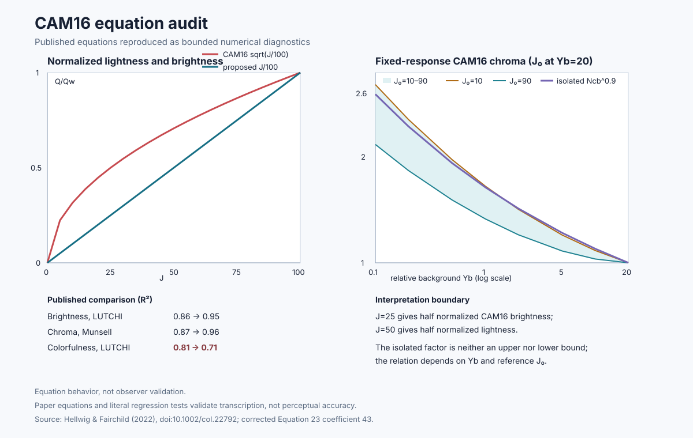

# Auditing inherited color-model equations

[Detailed report](../reports/CAM16_EQUATION_AUDIT.md) ·
[figure](../figures/cam16_equation_audit.svg) ·
[data](../data/cam16_equation_audit.csv) ·
[historical CIE94 fixture](../data/cie94_historical_24patch.csv) ·
[implementation](../../src/cam16_equation_audit.cpp) ·
[tests](../../tests/test_cam16_equation_audit.cpp)

## What this is about

A color appearance model predicts how a color will *look* under stated viewing
conditions, not merely what it measures. Brightness, lightness, colorfulness,
and chroma all shift with the surround and background even when the stimulus is
unchanged, which is why appearance models matter to display rendering and
cross-condition color work. CAM16 is a CIE-derived model of that kind. This
study traces a declared subset of published equations and revisions rather
than treating an inherited formula as self-validating.

Inherited equations carry inherited surprises: coefficients that were corrected
after publication, terms that behave unexpectedly toward the edges of their
range, and tradeoffs that a summary can quietly drop. This study turns a small,
declared set of those equations into inspectable C++ with numeric tests, so the
behavior can be checked rather than assumed. It audits specific equations; it
does not implement the full model or validate it against observers.

## Question

Can published color-appearance equations be turned into small, inspectable
tests that expose their behavior without overstating equation agreement as
perceptual validation?

## Result

The audit reproduces two numerical consequences discussed by Hellwig and
Fairchild. On CAM16's lightness scale `J`, which runs from black at 0 to white
at 100, half lightness is `J = 50`. Normalized brightness follows a different,
square-root relation, so half brightness occurs much earlier, at `J = 25`.

A second diagnostic isolates a background-adaptation factor written
`N_cb^0.9`. Here `Y_background` expresses background luminance relative to the
reference white. Compared with the reference condition `Y_background = 20`,
the factor rises to `1.283` at 5, `1.715` at 1, and `2.595` at 0.1 as the
background darkens.

The paper-derived reference-`J = 10…90` sweep then evaluates the complete CAM16
chroma expression while adapted responses are held fixed. At
`Y_background = 0.1`, the coupled result spans `2.120–2.687`, crossing both
sides of the isolated `2.595` value.
The isolated factor is therefore neither an upper nor a lower bound. This is a
declared equation contract, not a general CAM16 forward transform or a failure
assigned to a display technology.

The audit also pins the corrected Equation 23 coefficient `43` and retains the
paper's unfavorable result: its proposed colorfulness relation reduced the
reported LUTCHI `R²` from `0.81` to `0.71`, even while brightness and Munsell
chroma improved. Retaining that result prevents the paper from being summarized
only by its favorable outcomes.

## Connection to earlier work

A prior color-management study reported CIE94 results but did not retain the
formula convention used by its third-party tool. All 24 rounded Lab pairs
survive, so the table can be recomputed under several plausible conventions.
The historical geometric-mean-chroma variant produces a worst-two value of
`6.919`, close to the printed `6.92`; the two standard directional conventions
bracket it at `6.879` and `6.959`.

That supports a bounded conclusion: the retained table is internally
consistent. Because only rounded inputs and no tool settings survive, the audit
compares both standard directions and a separately named historical variant
rather than claiming exact reproduction. The improvement is an explicit method
— reference direction, application weights, and numerical limits — rather than
a claim that the earlier arithmetic was wrong.

The equation audit uses the retained rounded table and adds no new capture
measurement. CIE94 appears here to preserve and test that prior result;
CIEDE2000 appears in the current CCM and gamut studies under their own declared
contracts. Their formulas and weighting conventions differ, so the values are
method-specific and are not compared numerically across studies.

## Interpretation

The central lesson is that reproducing one published example does not validate
an inherited equation. A useful audit must also separate an individual factor
from the complete expression, vary the conditions around it, pin later
corrections, and retain outcomes that became worse as well as those that
improved. Here the isolated background term looked large, but the coupled
chroma expression crossed to both sides of it; reading the term alone would
have suggested a bound that the complete equation does not have.

The historical CIE94 exercise shows the same discipline at a smaller scale.
Several conventions can reproduce the rounded table closely, but the missing
tool settings prevent choosing one as uniquely correct. Naming and testing the
plausible conventions is a stronger scientific result than manufacturing
certainty from incomplete records.

*Left: normalized lightness and brightness plotted against `J`. Lightness is the
straight line, so half lightness sits at `J = 50`; CAM16 brightness follows the
square-root curve, so half brightness sits at `J = 25`. The gap between the two
curves illustrates their different scaling. Right: how the chroma
expression responds as the background darkens, with the isolated `N_cb^0.9`
factor shown against the complete expression evaluated across reference
lightness — the band crosses the isolated line, which is what makes the isolated
term neither a floor nor a ceiling.*

The curves are equation-level diagnostics with fixed adapted responses. They do
not replace a general CAM16 forward model, viewing-condition validation,
observer data, or a validated image-rendering study.
