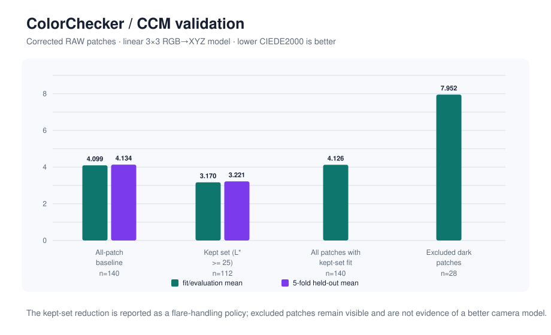
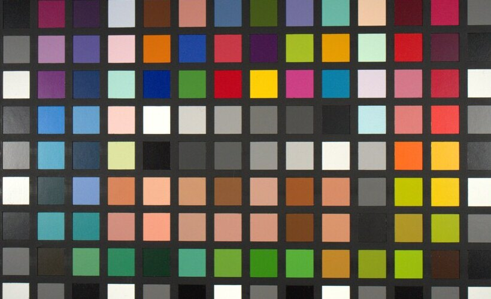

# ColorChecker extraction and CCM validation

## Overview

The corrected 140-patch RAW ColorChecker-SG workflow reached 4.134 mean held-out
CIEDE2000 against a compatible spectral reference. The result integrates
extraction checks, flat-field and white-balance policies, RGB-to-XYZ CCM
fitting, and explicit dark-patch and reference-provenance diagnostics.

[Documentation index](../README.md) ·
[CCM report](../reports/CCM_FIT.md) ·
[patch report](../reports/PATCH_EXTRACTION.md) ·
[reference provenance](../reports/SG_REFERENCE_PROVENANCE.md) ·
[aggregate CSV](../data/ccm_validation_summary.csv)

The `clrs589_project_camera` archive retains the RAW, flat-field, and dark
captures but not an exact per-unit spectral measurement of the captured chart.
The analysis therefore uses a compatible SG spectral
reference verified against manufacturer nominal values. This preserves a
physically specified 140-patch target for pipeline and held-out validation
while bounding the result to compatible-reference, not per-unit, color
difference.

## Problem and relevance

A color-correction matrix can look good on its training patches while hiding
coordinate errors, chart-order mistakes, near-ceiling flat fields, dark-patch flare,
or reference mismatch. The goal was therefore an inspectable measurement chain,
not a single optimized Delta E number.

*Illustrative crop from the source test capture. The implementation samples
rectangular regions after RAW unpack, black handling, and bilinear demosaic;
this reduced image is not a calibration reference.*

## Technical approach

- RAW rectangle extraction through the toolkit's LibRaw, black handling, and
  bilinear demosaic.
- Optional image-domain flat-field correction with a near-ceiling rejection
  guard and recorded clamped-sample count.
- Explicit white-balance gains or a flat-field-derived green-anchor policy.
- ColorChecker-SG orientation controls and a comparison path against exported
  reference-tool rectangles.
- Spectral-reference rendering under a supplied illuminant.
- Linear 3×3 RGB-to-XYZ least-squares fitting, Delta E 76/CIEDE2000, five-fold
  held-out diagnostics, and labeled dark-patch selection.

## Validation

Uncorrected patch extraction matched the reference-tool averages with
correlations above **0.99999998** and direct RMSE of **0.352 / 0.041 / 0.381
DN** for R/G/B. The direct-vs-flipped orientation controls separated clearly.

The corner-seeded grid was not used for the reported CCM result: although RGB
correlations remained above 0.999, generated centers missed the oracle by up to
16.449 px. RawDigger rectangles therefore remain the coordinate source for the
reported CCM result.

## Results and engineering decision

The corrected 140-patch RAW path produced:

- training mean CIEDE2000: **4.099**;
- deterministic five-fold held-out mean CIEDE2000: **4.134**;
- dark-patch mean CIEDE2000 for `L* < 25`: **7.890**.

An explicit `L* >= 25` kept-set fit lowered held-out mean CIEDE2000 to 3.221,
but all patches under that fit remained 4.126 and the excluded subset remained
7.952. The reduction is therefore reported as a flare-handling policy, not
evidence that discarding difficult patches created a better camera model.

## What the correction flat contributes

The flat used to correct these patches, `Sphere_f8.0_1:1000_DSCF0387.RAF`, is
the same frame characterized in the
[CFA flat-field case study](cfa-flat-field-response.md), so it is measured
rather than assumed: green falls to 0.4816 of center, `C_BG` reaches 1.0447,
`C_RG` falls to 0.9773, and it is 0% near ceiling in both the whole frame and
the centered gate. Dividing by it therefore removes a strong intensity gradient
and a smaller chromatic one across the chart area. What it cannot do is separate
sphere nonuniformity from camera response, so this path is
same-aperture-corrected, not shading-calibrated.

Flat-field admission uses the same source-CFA, per-position limits as
`shading`, including separate full-frame and centered-region measurements.
This rejects a frame whose bright center is near ceiling even when its
whole-frame fraction is below the limit. The selected 1/1000 s flat remains
accepted; its full-frame valid-sample mean supplies the correction
normalization.

## Interpretation limits

The spectral reference is a compatible SG reference verified against
manufacturer nominal values; it is not proven to be the exact per-unit chart
used for the capture. Held-out folds are deterministic patch partitions, not a
second physical chart session. The corrected evidence is scoped to the f/8
capture because the available f/9 same-aperture sphere flats were too close to
sensor ceiling.

## Code and verification

- Patch extraction:
  [`src/patches.cpp`](../../src/patches.cpp) and
  [`tests/test_patches.cpp`](../../tests/test_patches.cpp)
- Chart geometry:
  [`src/chart_localization.cpp`](../../src/chart_localization.cpp) and
  [`tests/test_chart_localization.cpp`](../../tests/test_chart_localization.cpp)
- Colorimetry and CCM:
  [`src/colorimetry.cpp`](../../src/colorimetry.cpp) and
  [`tests/test_colorimetry.cpp`](../../tests/test_colorimetry.cpp)
- CLI/serialization:
  [`src/cmd_ccm_fit.cpp`](../../src/cmd_ccm_fit.cpp) and
  [`tests/test_cmd_ccm_fit.cpp`](../../tests/test_cmd_ccm_fit.cpp)
- Figure generator:
  [`tools/generate_portfolio_figures.py`](../../tools/generate_portfolio_figures.py)
