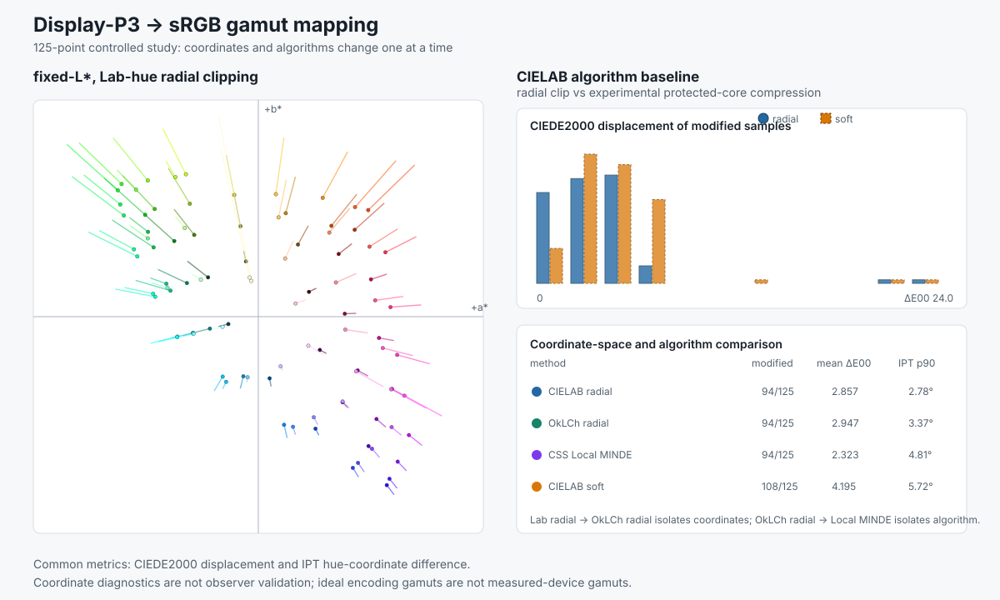

# Display-P3 to sRGB gamut mapping

## What this is about

A wide-gamut encoding such as Display-P3 can represent colors that sRGB cannot.
Whenever such an image is delivered to an sRGB destination, something has to
decide where those unreachable colors land. Per-channel clipping can shift hue
and flatten distinctions, while broad compression can unnecessarily change
colors that were already usable. The decision is an engineering tradeoff.

This study makes that normally hidden decision inspectable. Four declared
methods run over the same colors, changing one design choice at a time, so the
effect of the coordinate system can be separated from the effect of the mapping
rule. The question is how to move a color from a wider encoding into a smaller
destination without shifting hue unnecessarily, crushing distinctions, or
changing colors that already fit.

[Detailed report](../reports/GAMUT_MAPPING.md) ·
[figure](../figures/gamut_mapping_synthetic.svg) ·
[CIELAB-radial data](../data/gamut_synthetic_radial.csv) ·
[OkLCh-radial data](../data/gamut_synthetic_oklch_radial.csv) ·
[CSS Local-MINDE data](../data/gamut_synthetic_css_local_minde.csv) ·
[soft-compression data](../data/gamut_synthetic_soft.csv) ·
[implementation companion](../implementation/gamut-mapping.md)

## Headline results

Changing only the radial coordinates from CIELAB to OkLCh — the cylindrical
lightness, chroma, and hue form of OkLab — retained much more
P3-yellow chroma (`0.211` versus `0.058`) and reduced that sample's CIEDE2000
color difference from `23.928` to `5.523`, where lower is better. The grid mean
rose from `2.857` to `2.947` and the worst point moved from yellow to red, so
the coordinate change is a targeted trade rather than a universal improvement.
Changing only the OkLCh algorithm to CSS Local MINDE, a local
minimum-color-difference search, then reduced the complete-grid
mean from `2.947` to `2.323` and the maximum from `9.956` to `7.602`, while
widening the 90th-percentile hue shift in the separate IPT color model from
`3.368°` to `4.806°`.

*Left: the CIELAB `a*b*` plane under the fixed-lightness, fixed-hue radial
baseline. Each segment joins a sample's input chroma to its mapped chroma, so
longer segments mean more chroma was removed. Upper right: a paired 12-bin
histogram of modified-sample CIEDE2000 values for the radial baseline and the
experimental protected-core method; bar height is the bin count normalized to
the tallest bin, not an individual sample value. Lower right: all four methods
compared by modified-sample count, grid-mean CIEDE2000, and 90th-percentile IPT
hue shift. Together the panels show why no single aggregate makes one method a
uniform improvement.*

## Relationship to the earlier color-management work

An earlier art-reproduction color-management course project measured the output
of a configured third-party gamut-mapping path inside a larger capture-to-print
workflow. ProfileMaker exposed `Papercolored Gray` intent and `LOGO Classic`
gamut mapping as configured choices: the project could measure their output but
could not inspect or isolate the underlying algorithm. This study moves that
same wide-to-narrow-gamut question into a fully specified implementation using
Display-P3 and sRGB encodings. Deterministic synthetic input separates the
transform, boundary search, coordinates, and mapping rule from camera, printer,
and proprietary-profile variables. It is a separate engineering experiment,
not a reconstruction of the course project.

That course work reproduced fine-art photographic prints, where the practical
stakes are neutrality and tonal separation surviving the move from screen to
print. Those stakes are what make the mapping decision worth specifying rather
than delegating, and they are why this study reports hue behavior and preserved
distinctions alongside color difference instead of ranking methods on a single
displacement number. The earlier workflow included an Ansel Adams *Moonrise*
print; that recognizable example explains why opaque rendering choices mattered
in the print workflow, but it is historical context rather than an input to the
current synthetic study.

## Why the boundary search is not a simple bisection

A constant-Lab-hue path can leave an RGB gamut and later re-enter it. A fixed
0.25-C\* membership scan stepped straight over a narrow excursion in an
adversarial high-lightness ray, sampling in-gamut on both sides and selecting
the wrong boundary. The final solver instead represents each destination
channel as a piecewise cubic function of chroma, enumerates its `0` and `1`
surface crossings, and refines the first in-to-out transition. This turns a
visual assumption about gamut shape into a tested numerical contract.

## Method: a controlled mapping comparison

Each method converts Display-P3 through linear RGB and D65 XYZ, performs the
mapping in CIELAB or OkLCh, converts the result to sRGB, and verifies the
unclipped linear output against the destination cube.

The fixed-L\*, Lab-hue radial clip is the reference method. It preserves every
destination-in-gamut color and clips only out-of-gamut chroma to the first
neutral-connected boundary.

An OkLCh radial clip holds the mapping rule constant while changing only the
coordinates. A dated CSS Color 4 Local-MINDE implementation then holds OkLCh
constant while changing the algorithm. This two-step design separates the
effect of coordinate choice from the effect of the mapping rule.

The experimental soft intent preserves a core below `75%` of the destination
boundary, then applies a monotone asymptotic compression. It deliberately
changes part of the in-gamut shoulder and reports its unused boundary headroom.
The method holds the CIELAB hue angle numerically; it does not assume that this
guarantees constant perceived hue.

## Findings

On a deterministic 125-point encoded Display-P3 cube, 94 points lay outside
sRGB. All three relative-colorimetric methods changed exactly those 94 points;
the experimental soft intent changed 108.

The soft intent increased the grid mean to `4.195` and used a median `91.3%`
of the destination boundary among modified points. It remains a useful design
experiment, but this grid does not support presenting it as a better result.

A secondary IPT audit showed that holding either CIELAB or OkLCh hue still
moves hue in another model. OkLCh radial reduced the CIELAB baseline's median
and maximum IPT-hue differences (`0.72°` to `0.41°`, and `12.69°` to `10.26°`)
but increased its 90th percentile (`2.78°` to `3.37°`). Local MINDE reduced
the worst case again to `9.22°` while increasing the 90th percentile to
`4.81°`. These values reveal coordinate dependence; they are not observer
validation.

The original yellow result is also a warning about the baseline. The legal
source color has `C*=127.63`, but its first neutral-connected Display-P3
boundary is `28.48` and the sRGB boundary is `22.74`. Radial clipping
deliberately follows the first connected region and therefore overcompresses
this disconnected high-chroma ray. The case demonstrates correct boundary
handling and a reason not to treat the baseline as a finished rendering
intent.

The comparison exposes two practical lessons: changing coordinates can fix a
specific overcompression failure without improving every aggregate, and a
lower color-difference score can accompany a larger hue-diagnostic tail. A
rendering intent should therefore be evaluated against its application rather
than selected from one displacement number.

The underlying Display-P3 and sRGB conversions agree with independently
constructed LittleCMS profiles to `1e-6` per encoded channel on the tested
common-gamut samples in both directions. This cross-check supports the
color-space transforms; it does not validate the toolkit's boundary search or
mapping intents.

## What the result does not establish

The result characterizes ideal Display-P3 and sRGB encoding gamuts. It is not a
measured display-gamut result, an ICC printer proof, or an appearance match.
The synthetic cube makes the implementation and tradeoffs inspectable without
depending on private capture data. The dated CSS method is one algorithm in a
work-in-progress specification for individual SDR colors; it is not a spatial
image-rendering evaluation.
