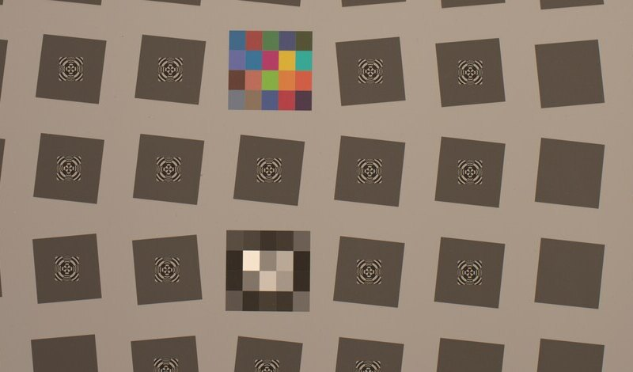

# Nikon D800/D810 + 50 mm f/1.4G slanted-edge SFR: aperture and field behavior

## What this is about

Lens sharpness changes with aperture. Wide open, optical aberrations can soften
detail; stopped down far enough, diffraction does. Reviews often summarize the
balance with one number measured at the image center, but that number can hide
field tilt, decentering, weak corners, or a capture-specific focus error.

This study therefore asks two questions: where does center sharpness peak, and
does the same behavior hold across the rest of the image? Slanted-edge spatial
frequency response (SFR) measures how much contrast the complete capture system
preserves as detail becomes finer. Its most familiar summary, MTF50, is the
spatial frequency where contrast has fallen to half its low-frequency value.

Across 299 measured chart regions, the D810 capture system showed a clear f/5.6
center peak. The D800 system followed a different aperture trend and became
sharper away from the center at several apertures. Because SFR includes the
lens, aperture, focus and alignment, optical low-pass filter, sensor sampling,
and processing path, these are capture-system findings—not a body or lens
ranking.

[Documentation index](../README.md) ·
[detailed report](../reports/SFR_MTF.md) ·
[capture inventory](../reports/SFR_MTF_ARCHIVE_INVENTORY.md) ·
[aggregate CSV](../data/sfr_aperture_summary.csv) ·
[implementation companion](../implementation/sfr-mtf.md)

*Panel A: center sharpness (MTF50, in cycles per pixel — higher resolves finer
detail) against aperture for both capture systems. Solid lines are this
toolkit's sensor-linear green measurement; dashed lines are the advisory Imatest
values, which run a different luma and gamma path and so are read as a
consistency check rather than as agreement. The D810 curve peaks at f/5.6, the
location expected from the usual balance between residual aberrations and
diffraction, but this archive does not isolate that cause; the D800 curve does
not follow it. Panel B: paired bars for the f/4–f/11 field-map apertures, blue
for D810 and orange for D800. Each bar is center minus strongest physical
corner, so a positive value means the center outresolves the corner. Where that
margin goes negative, the corner is sharper than the center — which is why a
center-only number cannot describe either system.*

## Method

Slanted-edge SFR recovers a system's response to fine detail from a photograph
of a single edge. The edge is deliberately tilted a few degrees from vertical so
that successive scan lines each sample it at a slightly different sub-pixel
offset; combining those lines reconstructs the edge profile far more finely than
the pixel pitch alone would allow.

The measurement runs on sensor-linear green samples taken straight from the
black-subtracted Bayer mosaic — no demosaic, no luma conversion, no gamma —
because every one of those steps is itself a spatial filter and would be
measured as part of the capture-system response.

From there: fit the edge from per-scan-line centroids, accumulate the
oversampled edge-spread function in 0.25 px bins, differentiate it to the
line-spread function, window it, and transform to get modulation against spatial
frequency. Differentiating a binned signal attenuates high frequencies by a known
amount, so that attenuation is corrected rather than left in the result. Reported
quantities are MTF50, MTF50P, MTF at Nyquist, 10–90% rise distance, and the
measured edge angle, with saturated or otherwise unusable regions rejected and
their diagnostics retained.

## Study material and comparison

The study uses archived D800 and D810 slanted-edge RAW captures plus matching
per-file result tables. Source captures remain outside Git. Imatest values are
an advisory fidelity reference because its luma/gamma pipeline differs from the
toolkit's sensor-linear green path.

The archive retains both RAW sweeps and one matched per-file advisory batch
generated after capture. It does not retain lens serial identity, controlled
refocusing, repeat captures, or controlled coverage of both principal edge
orientations (often described as sagittal and tangential). The study
therefore treats the advisory values as a cross-check, reports
capture-system-specific trends, and does not turn the common lens-model label
into a universal body or lens rule.

*Illustrative crop from the source test capture. Numerical analysis uses
sensor-linear green samples inside the selected edge regions; this reduced image
is not an analysis input.*

### Recorded capture configuration

All 18 aperture-sweep files record the same AF-S Nikkor 50mm f/1.4G lens
model at 50 mm, an approximate 0.84 m focus distance, and ISO 100. The
full per-file metadata audit is in the
[archive inventory](../reports/SFR_MTF_ARCHIVE_INVENTORY.md#capture-metadata-audit).
The two sets differ in ways that matter:

| Property | D810 set | D800 set |
|---|---|---|
| Files audited | 9/9 | 9/9 |
| Focus mode | AF-S | Manual |
| `FocusPosition` raw code | `0x11` in all files | `0x11` in all files |
| Optical low-pass filter | absent | present |

`FocusPosition` is an opaque maker-note code, and ExifTool identifies the
related focus distance as approximate. Its constant value documents metadata
consistency; it does not prove unchanged focus or focus accuracy. The lens
serial number is absent, so the archive proves the same lens model, not the same
physical sample. The timestamps come from different camera clocks with no
retained synchronization record, so they support ordering within each sweep but
not elapsed time between sweeps or a shared physical lens.

Nikon specifies the D800 with an enhanced OLPF and the D810 without an OLPF;
both are specified at 35.9 x 24.0 mm and 7360 x 4912 pixels. Their nominal
sampling pitch therefore matches, so the cycles/pixel comparison is not
confounded by a nominal pixel-pitch difference. The matching scale does not
remove the other capture-system differences.

The complete sweeps contribute 92 D810 regions and 207 D800 regions. Synthetic
edges with known responses check the numerical method, while the matched
Imatest tables provide an advisory comparison on the same captures. Because
Imatest uses a different rendered-luma and gamma path, agreement is judged in
trends and plausible scale rather than exact equality.

## Findings

The two sweeps do not support one universal aperture conclusion:

- The D810 capture system peaked at **0.2714 cycles/pixel at f/5.6** in center
  MTF50. That location is consistent with the usual balance between residual
  lens aberrations wide open and diffraction on stopping down, but it is a
  property of this system and setup, not of the camera or the lens alone.
- D810 center exceeded the strongest physical corner at f/5.6, f/8, and f/11;
  f/4 was a near tie/slight corner win.
- D800 did **not** reproduce the D810 aperture trend. Both this analysis and
  the advisory results keep f/4 below f/16 at center.
- The D800 field maximum moved away from center through the mid apertures; the
  toolkit and advisory source agreed on the dominant location at f/4 through
  f/11. At f/4 the toolkit's strongest physical corner exceeds its center by
  32%. The advisory table for that file labels no ROI `Corner` — its regions are
  `Center` and `Pt Way` — so the comparable advisory figure is its
  most-peripheral ROI, +19% over center. The mid-aperture maximum sits at grid
  point N=12, a top-center edge 1414 px above center, and +60% over center in
  the advisory path.
### Why the field asymmetry is credible

The chart did not contain exact mirror-image regions, but it did contain three
close pairs reflected across the horizontal axis. For an exactly vertical edge,
such a reflection preserves both distance from center and the mixture of radial
and tangential response. A centered, rotationally symmetric system should
therefore give nearly equal MTF50 at the two sites, even if it is astigmatic.

| Pair | Difference in radius | Difference in orientation mixture | MTF50 upper | MTF50 lower |
|---|---:|---:|---:|---:|
| N=14 / N=16 (f/4) | 0.54% | 0.80% | 0.1403 | 0.1054 |
| N=2 / N=4 | 0.76% | 1.24% | 0.1647 | 0.0945 |
| N=18 / N=20 | 4.06% | 3.78% | 0.1878 | 0.1055 |

All three pairs favor the upper field, across three radii and two apertures. In
every pair, the stronger upper site is also slightly farther from center—the
opposite ordering from a centered response that simply falls with radius. In
the closest pair, MTF50 changes by 33% while radius and orientation mixture
differ by only 0.54% and 0.80%.

This is strong evidence against centered rotational symmetry, but not a formal
exclusion. Every archived edge is near-vertical, so a response that depends on
both radius and edge orientation remains possible. Controlled radial and
tangential targets would close that alternative. The responsible component is
also unresolved: tilt, decentering, and alignment can all produce an upper/lower
imbalance, and stopping down can reduce several of those effects at once.

Center agreement with the advisory analysis stayed within ±0.015 cycles/pixel
on D800, while off-axis differences were larger—consistent with comparing a
sensor-linear green measurement to a rendered-luma path. The center agreement
makes a large numerical error in this analysis less likely, but both paths use
the same captures and cannot independently identify the physical cause.

The practical conclusion is that the two capture systems need separate field
criteria. A single threshold wide enough to pass both would hide the different
behaviors that the measurement revealed.

## What the result does not establish

This is a system SFR study, not a standalone lens characterization: it lacks
verified lens-sample identity, controlled refocusing, repeat captures, lp/mm
normalization, and sagittal/tangential coverage. It is also sensor-linear green
SFR, not rendered-Y equivalence.

The D800/D810 gap cannot be attributed to one component. Their OLPF designs
differ, which is a plausible body-side contribution, but this archive does not
isolate its magnitude. Focus mode, capture/alignment state, and unverified focus
accuracy also differ. The common lens-model label does not establish a shared
lens sample, and the unsynchronized camera clocks add no physical-identity
evidence. The result therefore does not rank lens, body, or setup
contributions.
