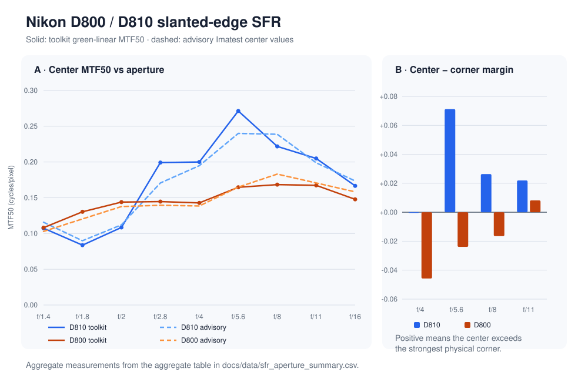

# D800/D810 slanted-edge SFR and field analysis

Evidence runs: 2026-07-08<br>
Implementation validation refreshed: 2026-07-28

**Result:** the C++ green-linear SFR path accepted all 299 field ROIs in the
published D800/D810 sweeps. The D810 center response peaked at f/5.6 and showed
positive center-to-corner margin from f/5.6 through f/11. The same trend did not
transfer to the D800; that camera/capture set retained a different center curve
and field maximum.

[Portfolio case study](../case-studies/sfr-mtf-aperture-field.md) ·
[publication-safe aggregate CSV](../data/sfr_aperture_summary.csv) ·
[archive and oracle contract](SFR_MTF_ARCHIVE_INVENTORY.md)



## Measurement model

The `sfr` command:

- reads LibRaw active-area, black-subtracted Bayer samples;
- uses green CFA positions in native sensor coordinates;
- converts a full-frame advisory ROI into active-area coordinates;
- estimates the slanted edge from per-line derivative centroids;
- projects samples into a 0.25 px ESF and bounds missing-bin interpolation;
- differentiates to an LSF, applies a Hamming window, and runs an in-repo DFT;
- applies adjacent-difference attenuation correction;
- reports MTF50, MTF50P, MTF at sensor Nyquist, R1090, edge angle, saturation,
  rejection diagnostics, and filename/EXIF checks.

`--field-map` applies the same estimator to all 23 ROIs in one coherent
per-file advisory table. The parser preserves row, grid/edge identity,
field offset, ROI, and reference values, but emits only basenames for any
referenced summary file.

The implementation validates finite/ranged options at CLI and public-library
boundaries, rejects non-finite RAW samples and metadata, bounds ESF allocation,
uses the configured minimum scan-line sample count, validates oracle geometry
and duplicate rows, and emits measurement-only values as JSON `null` when a
center is rejected.

## D810 50 mm center sweep

Dataset label: `archive:2016_esensi_images/2016_12_09_D810_SFR/`

The advisory rows come from one 10-Dec-2016 per-file batch. The center edge is
near-vertical in the toolkit convention.

| Aperture | Accepted | Angle deg | Toolkit MTF50 | Advisory MTF50 | Delta | MTF@Nyq | R1090 px |
|---|---:|---:|---:|---:|---:|---:|---:|
| f/1.4 | true | -6.320 | 0.1074 | 0.1158 | -0.0084 | 0.0210 | 5.142 |
| f/1.8 | true | -6.320 | 0.0837 | 0.0899 | -0.0062 | 0.0802 | 6.852 |
| f/2 | true | -6.326 | 0.1085 | 0.1121 | -0.0036 | 0.0271 | 5.311 |
| f/2.8 | true | -6.428 | 0.1992 | 0.1707 | +0.0285 | 0.0928 | 2.727 |
| f/4 | true | -6.528 | 0.2000 | 0.1949 | +0.0051 | 0.0894 | 2.639 |
| f/5.6 | true | -6.423 | 0.2714 | 0.2400 | +0.0314 | 0.1727 | 2.249 |
| f/8 | true | -6.438 | 0.2218 | 0.2388 | -0.0170 | 0.1682 | 2.703 |
| f/11 | true | -6.419 | 0.2049 | 0.1989 | +0.0060 | 0.0862 | 3.060 |
| f/16 | true | -6.431 | 0.1666 | 0.1735 | -0.0069 | 0.0237 | 3.560 |

The predeclared D810 center trend passed:

```text
min(f/4,f/5.6,f/8,f/11) = 0.2000
f/16                    = 0.1666
max(f/1.4,f/1.8,f/2)    = 0.1085
argmax                  = f/5.6 at 0.2714
```

## D810 field result

All 92 ROIs across the four field apertures were accepted. Detected orientation
was near-vertical for every ROI; direction labels from the advisory table were
not used as a substitute for pixel measurement.

| Aperture | ROIs | Center MTF50 | Physical-corner max | Center − corner |
|---|---:|---:|---:|---:|
| f/4 | 23 | 0.2000 | 0.2005 | -0.0005 |
| f/5.6 | 23 | 0.2714 | 0.2001 | +0.0712 |
| f/8 | 23 | 0.2218 | 0.1955 | +0.0263 |
| f/11 | 23 | 0.2049 | 0.1830 | +0.0219 |

The f/4 near tie is retained. A strict center-above-corner rule would
misrepresent both the pixels and the advisory comparison.

## D800 replication and non-transfer finding

The D800 sweep used nine matching per-file advisory tables from one
10-Dec-2016 batch. All **207/207 ROIs** were accepted and detected as
near-vertical.

| Aperture | Advisory center | Toolkit center | Delta | Toolkit corner max | Center > corner (advisory / toolkit) | Argmax N (advisory / toolkit) |
|---|---:|---:|---:|---:|---|---|
| f/1.4 | 0.1029 | 0.1082 | +0.0053 | 0.0978 | true / true | 1 / 1 |
| f/1.8 | 0.1204 | 0.1304 | +0.0100 | 0.1058 | true / true | 1 / 1 |
| f/2 | 0.1377 | 0.1439 | +0.0062 | 0.1113 | true / true | 1 / 1 |
| f/2.8 | 0.1395 | 0.1447 | +0.0052 | 0.1535 | true / false | 12 / 8 |
| f/4 | 0.1385 | 0.1428 | +0.0043 | 0.1885 | false / false | 12 / 12 |
| f/5.6 | 0.1649 | 0.1647 | -0.0002 | 0.1886 | false / false | 12 / 12 |
| f/8 | 0.1831 | 0.1684 | -0.0147 | 0.1849 | true / false | 12 / 12 |
| f/11 | 0.1707 | 0.1674 | -0.0033 | 0.1592 | true / true | 12 / 12 |
| f/16 | 0.1583 | 0.1478 | -0.0105 | 0.1367 | true / true | 1 / 13 |

Load-bearing findings:

- **The D810 aperture gate correctly fails on D800.** D800 f/4 center is below
  f/16 in both toolkit and advisory results.
- **The field maximum moves off center.** The advisory maximum is grid point
  N=12 at f/2.8 through f/11; the toolkit agrees from f/4 through f/11.
- **Center/corner behavior is not monotonic.** At f/4 and f/5.6 the strongest
  physical corner exceeds center in both paths.
- **Off-axis reference deltas are larger.** Green-linear CFA SFR and
  rendered-luma processing diverge more away from center. The disagreement is
  reported rather than used as evidence of equivalence.
- D800 center values remain below D810 at matched plateau apertures, but the
  difference cannot be attributed to optical low-pass filtering alone because
  focus and field state also differ.

## Validation

Automated coverage includes:

- synthetic vertical and horizontal edges;
- MTF50/MTF50P, R1090, Nyquist, sinc correction, and DFT behavior;
- CFA-balanced ROI conversion and saturation rejection;
- missing/oversized ESF grids and bounded gap interpolation;
- non-finite inputs, option ranges, unknown options, and conflicting ROI modes;
- center/field advisory parsing, duplicate rows, geometry overflow, and missing
  required rows;
- rejected-result JSON nullability with retained diagnostics;
- D810 and D800 trend/field fixture pins, including the intentional D800 gate
  failure.

Local archive verification after validation hardening retained all 207 D800 and
92 D810 accepted ROIs. Acceptance, aperture ordering, and the engineering
interpretations above were unchanged; two D810 corner values moved by 0.0001
cycles/pixel at four-decimal reporting precision.

## Interpretation limits

- The toolkit does not claim absolute Imatest equivalence. Repeated advisory
  batches disagree with each other at some apertures.
- The path is linear green CFA, not demosaiced/luma/gamma parity.
- MTF is reported in cycles/pixel; no lp/mm or LW/PH conversion is claimed.
- Field maps sample the provided slanted edges. They are not a complete
  sagittal/tangential lens model.

## Implementation and tests

- [`include/camera_iq/sfr.hpp`](../../include/camera_iq/sfr.hpp)
- [`src/sfr.cpp`](../../src/sfr.cpp)
- [`src/cmd_sfr.cpp`](../../src/cmd_sfr.cpp)
- [`tests/test_sfr.cpp`](../../tests/test_sfr.cpp)
- [`tests/test_cmd_sfr.cpp`](../../tests/test_cmd_sfr.cpp)
- [`tools/generate_portfolio_figures.py`](../../tools/generate_portfolio_figures.py)
