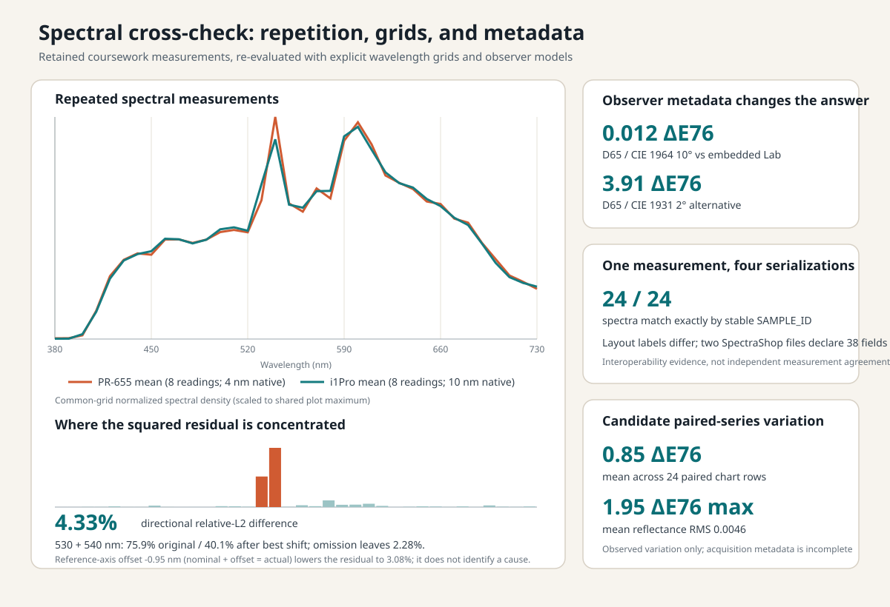

# Spectral measurement and reference-data cross-check

Spectral measurements can disagree because the measured source changed, the
instruments sampled wavelength differently, or metadata led the calculation to
the wrong colorimetric model. This study separates those cases in retained
coursework data: repeated HID-lamp spectra labeled for two instruments,
ColorChecker reflectance exported by two applications, and a candidate pair of
chart measurements.

The report name follows the archive's 2017 coursework grouping, not a shared
acquisition year. The four CGATS headers specifically record November 2016;
the HID and candidate-pair files do not preserve a complete acquisition date.

The strongest result is diagnostic rather than causal. The two HID series
differ by **4.327% directional relative L2** after comparison on a shared
380–730 nm, 10 nm grid, while the maximum within-series shape residuals are
**0.307%** and **0.207%**. Two neighboring bands, 530 and 540 nm, account for
**75.9% of the squared residual**. Removing those bands reduces the comparison
to **2.276%**; a relative-axis sensitivity sweep reaches **3.084%** at
**−0.95 nm**. Neither diagnostic identifies whether wavelength registration,
spectral bandwidth, source variation, or another acquisition difference caused
the disagreement.

[Documentation index](../README.md) ·
[case study](../case-studies/spectral-archive-crosscheck.md) ·
[aggregate JSON](../data/hid_spectral_comparison.json) ·
[reference audit JSON](../data/spectral_reference_audit.json) ·
[paired-series CSV](../data/spectral_reference_repeat.csv) ·
[implementation companion](../implementation/spectral-crosscheck.md)



*The left panel compares the mean normalized shapes of eight readings in each
retained HID series. The bars below allocate squared residual by wavelength;
530 and 540 nm dominate. The right panels show that D65 with the CIE 1964
10-degree observer reproduces one export's embedded Lab values, that four files
contain the same 24 spectra despite different layout labels, and that a
candidate paired chart series retains measurable variation. These panels test
different questions and must not be combined into one accuracy score.*

## Questions

1. Is the difference between the two HID series larger than the variation
   within either series, and where is that difference concentrated?
2. Do four ColorChecker CGATS exports preserve the same spectra despite their
   schema and layout differences?
3. Which explicit illuminant and observer reproduce the colorimetry embedded
   by the source applications?
4. How much variation is present in a separate pair of 24-patch reflectance
   tables whose acquisition conditions are incompletely recorded?

## Inputs and evidence roles

| Input | Retained content | Evidence role |
|---|---|---|
| HID series labeled `PR655` | 8 readings, 380–780 nm at 4 nm | repeated spectral series and directional reference |
| HID series labeled `i1Pro` | 8 readings, 380–730 nm at 10 nm | repeated spectral series and comparison candidate |
| Four CC24 CGATS exports | 24 patches, 380–730 nm at 10 nm | interchange and source-application colorimetry |
| Candidate chart pair | 2 tables × 24 rows, 380–730 nm at 10 nm | observed paired-series variation |
| CIE D65 and standard observers | official source tables and derived 10 nm subsets | explicit colorimetric reference |

The instrument labels are retained archive identities. The files do not record
enough acquisition timing, geometry, source monitoring, instrument settings,
calibration state, or per-unit identifiers to treat the HID result as an
instrument-performance comparison. The candidate chart pair carries even less
acquisition metadata, so its differences are described only as observed
variation.

The exact source identities and normalized public inputs are bound by hashes in
the [sample-data receipt](../../data/samples/spectral_2017/source_receipt.json).
The CIE datasets, DOI records, transformations, and terms are documented in the
[third-party data notices](../../THIRD_PARTY_NOTICES.md).

## Method

### Separate level from shape

For reading `i` on a uniform native wavelength grid, the retained level is

```text
I_i = Δλ Σ_k x_i(λ_k)
```

and the normalized shape is

```text
s_i(λ_k) = x_i(λ_k) / I_i.
```

Here `x_i` is the recorded spectral value, `Δλ` is the native wavelength step
in nanometres, and `I_i` has the source value unit multiplied by nanometres.
The sample coefficient of variation of `I_i` describes level variation. The
largest relative L2 distance from the mean normalized shape describes
within-series shape variation. These quantities are reported separately
because a change in level need not imply a change in spectral shape.

### Compare different wavelength grids

Each series mean is linearly interpolated to the explicitly shared 380–730 nm,
10 nm grid and normalized again on that grid. Resampling before the second
normalization prevents the PR-655-only 740–780 nm tail from changing the
comparison scale. With `r_k` as the reference and `c_k` as the candidate, the
directional residual is

```text
E = sqrt(Σ_k (c_k - r_k)^2) / sqrt(Σ_k r_k^2).
```

The denominator makes the result directional; swapping the two series changes
its meaning. Each wavelength's localization fraction is
`(c_k-r_k)^2 / Σ_j(c_j-r_j)^2`. Diagnostic exclusions recompute `E` on the
retained bands without changing the original normalization.

The relative-axis sweep uses the convention
`reference nominal wavelength + δ = actual wavelength`. It evaluates a family
of re-registrations over −2 to +2 nm in 0.05 nm increments on the common
interior supported by every shift. It is a sensitivity analysis: a best-fitting
offset selected from the same spectra is not a wavelength calibration.

### Recompute source-application colorimetry

For a patch reflectance `R(λ)`, illuminant `S(λ)`, and explicitly selected
observer functions `x̄(λ), ȳ(λ), z̄(λ)`, tristimulus values are integrated with
trapezoidal weights:

```text
[X Y Z] = K Σ_k w_k R(λ_k) S(λ_k) [x̄(λ_k) ȳ(λ_k) z̄(λ_k)].
```

`K` normalizes the perfect diffuser to `Y = 100`; `w_k` is the trapezoidal
sample width. XYZ is converted to CIELAB using the integrated perfect-diffuser
white. The comparison uses CIE 1976 Delta E, the Euclidean distance between
the recomputed and embedded Lab coordinates.

Observer choice is never inferred from conflicting text. The primary
SpectraShop file declares both `OBSERVER_ANGLE 2` and an observer weighting of
10 degrees, so D65/10° and D65/2° are evaluated as explicit alternatives.

### Separate stable identity from layout labels

The CGATS files carry both `SAMPLE_ID` and `SAMPLE_NAME`. Sequence identity is
compared by `SAMPLE_ID`; layout labels are reported separately. This prevents a
different grid convention from silently turning a re-serialization into a
different physical patch set. Declared and actual row/field counts are also
kept separately. The two SpectraShop exports declare 38 fields while carrying
41; the two PatchTool exports correctly declare their respective 41- and
38-field layouts.

## Results

### HID repeated-series comparison

| Quantity | PR-655-labeled series | i1Pro-labeled series |
|---|---:|---:|
| Reading count | 8 | 8 |
| Native grid | 380–780 nm, 4 nm | 380–730 nm, 10 nm |
| Level coefficient of variation | 0.591% | 0.326% |
| Maximum normalized-shape relative L2 | 0.307% | 0.207% |

The full common-grid comparison is **4.327%**, about 14 times the larger
within-series maximum. The difference is therefore not explained by the
observed within-series shape spread alone. Bands 530 and 540 nm contribute
**25.8%** and **50.1%** of the squared residual, respectively. Omitting both
leaves **2.276%**.

The best value in the relative-axis sensitivity sweep is **−0.95 nm**, where
the residual is **3.084%**. Registration sensitivity removes part of the
difference but not all of it. At that best offset, 530 and 540 nm still carry
**40.1% of the squared residual**, so neither wavelength registration nor
a single wavelength-axis shift explains the remaining difference. The residual
localization does not identify whether bandpass or another factor is responsible.

### CGATS interchange and observer selection

| Check | Result |
|---|---:|
| Spectra preserved across four exports | 24/24, exact by stable identity |
| Declared versus actual fields | 38 versus 41 |
| SpectraShop Lab, D65/CIE 1964 10° | 0.0119 mean, 0.0412 max ΔE76 |
| SpectraShop Lab, D65/CIE 1931 2° | 3.909 mean, 12.346 max ΔE76 |
| BabelColor XYZ, D65/CIE 1931 2° | 0.0469% mean, 0.1104% max relative L2 |

The D65/10° result is more than 300 times smaller than the 2° alternative for
the SpectraShop Lab values. This independently resolves the contradictory
observer metadata for that export. BabelColor's embedded XYZ separately agrees
with the D65/2° calculation. These are useful external software checks because
the two applications computed colorimetry independently from the spectra.

The four files themselves are not four measurements. Their spectral values are
identical and only their serialization and layout labeling differ, so they
establish interchange fidelity rather than instrument agreement.

### Candidate paired chart series

Across 24 paired rows, the mean spectral reflectance RMS difference is
**0.00458** and the maximum is **0.00852**. Under D55 and the CIE 1931 2°
observer, the mean difference is **0.851 ΔE76** and the maximum is **1.952**.
The row alignment and numerical differences are reproducible, but missing
instrument/session metadata prevents a stronger repeatability or accuracy
interpretation.

## Legacy D800 spectral-response method audit

A separate retained Python 2 workflow identifies Bobby Gold as the original
author and Fernando Voltolini de Azambuja as the author of version 0.2 changes.
It produced a 35-band Nikon D800 response table, but only a dark frame and one
additional NEF survive in the retained archive. The original acquisition sweep
therefore cannot be re-derived or compared before and after a software
correction.
Selected privately retained, unredistributed method sources, both surviving
spectral-power input forms, the derived artifacts, and the complete recursive
NEF inventory are bound by filename, byte count, and SHA-256 in the
[legacy-method receipt](../../data/samples/spectral_2017/d800_legacy_method_receipt.json).
The receipt assigns this evidence to the path-free
`full_2017_coursework_tree` scope and records every archive-relative route for
selected evidence, including duplicate routes with identical content. This is
distinct from the `spectral_yes_subset` used for the primary cross-check.
The script accepted either XLSX or CSV input; the retained files do not prove
which pathname produced the retained response table.

The source still provides useful method evidence. It sampled a 10-pixel-thick
rectangle outline rather than the rectangle interior, depended on unsorted file
enumeration for wavelength pairing, and sampled images converted through
dcraw's `q=0` interpolation before the ROI stage. The separate conversion
script's dark-frame branch stopped its loop when the dark-frame name was
encountered instead of skipping only that entry. The workflow also lacked the
saturation and below-dark diagnostics needed to exclude unreliable wavelength
points.

The current RAW spectral-response path addresses those failure modes at the
code-contract level: it requires a contiguous sorted sweep, maps the validated
wavelength axis one-to-one to files, reads sensor CFA samples without demosaic,
subtracts a measured dark residual per CFA position, uses a CFA-balanced filled
ROI, and reports saturation and below-dark fractions per wavelength. This is a
comparison of methods, not an empirical correction of the retained D800 curve;
the 35 source captures needed for that experiment are absent.

## Interpretation and limits

The retained files are most valuable because their failure modes differ. The
HID series shows a localized cross-series disagreement that is much larger than
the observed within-series shape variation. The CGATS files show that exact
spectral interchange can coexist with contradictory metadata and different
layout labels. The chart pair shows measurable variation without preserving
enough conditions to assign a cause.

None of these results establishes instrument accuracy, calibration error,
spectral bandwidth, or source stability. Resolving the HID discrepancy would
require simultaneous or interleaved readings of a monitored source, recorded
instrument settings and calibration state, and a higher-resolution reference
measurement with characterized wavelength and bandpass performance. Resolving
the chart-pair variation would require the same physical chart, instrument,
geometry, illuminant, and timing to be documented.

## Engineering companion

The [implementation companion](../implementation/spectral-crosscheck.md)
explains the typed spectrum layer, common-grid comparison, CGATS diagnostics,
explicit observer path, command behavior, and executable verification.
